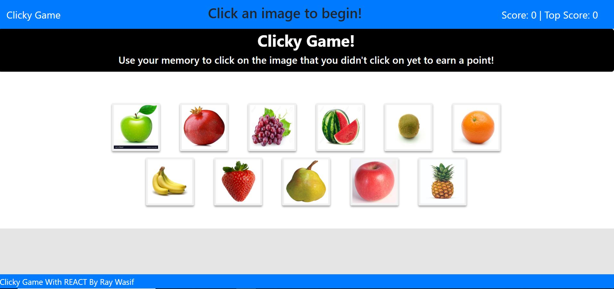

# Clicky Game With ReactJS

## Overview:

Player will try to memorize which picture clicked and will avoid clicking it again to gain point

## Technologies Used:
- React
- ES6
- Bootstrap
- Node.js

- NPM Packages Used:
    * React
    * Shuffle-array

## Builder:

- <strong>Ray Wasif</strong>

## [Click Here to Try the App](https://my-first-react-pro.herokuapp.com/)

## Screenshots:
- Main Page
 
